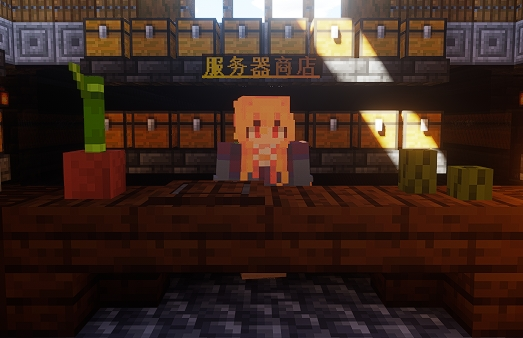
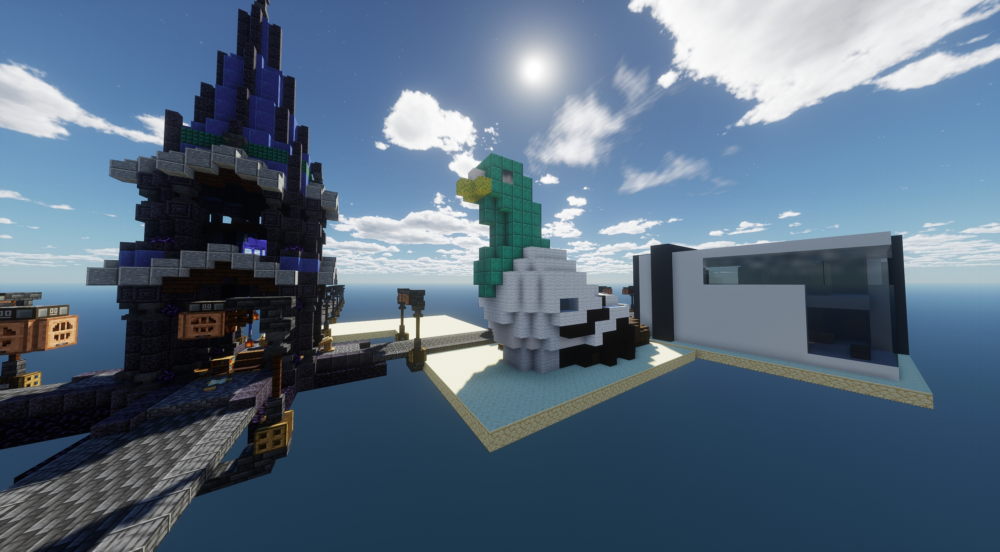

# ⚖️ 商店

> 服务器商店与玩家商店

## 服务器商店

服务器商店位于主城的西南角，使用次元币来购买物品

使用命令`/shop`可以随时随地打开商店

使用命令`/sellgui`打开界面，物品放入其中，关闭界面自动售卖为次元币

 

### 物品种类

<u>**商店售卖的物品分为17类**</u>

- 特殊物品 *(售卖服务器创新物品,比如:电吉他)*
- 夜市 *(每小时刷新一次,随机售卖6件商品)*
- 指令商店 *(售卖一次性指令)*
- 工作方块 *(售卖村民工作方块)*
- 矿物商店 *(售卖矿物)*
- 音乐商店 *(售卖唱片与山羊角)*
- 建筑方块 *(售卖绝大部分方块)*
- 农作物 *(售卖农产品)*
- 战利品 *(售卖生物战利品)*
- 附魔书 *(售卖所有附魔书)*
- 染料商店 *(售卖染料和花)*
- 杂项商店 *(售卖马凯与烟花等等...)*
- 食物商店 *(售卖大多数食物)*
- 装饰品 *(售卖蜡烛与珊瑚等等...)*
- 生物刷怪笼 *(暂无物品)*
- 红石商店 *(售卖红石物品)*
- 药水商店 *(售卖药水与药水箭)*

 

### 商店BUG反馈

- 如果商店的定价出现了问题(比如铁1块,铁块20块)请及时反馈给 <u>Linye_FL</u>进行调整
- 每次反馈问题都可获得<u>300次元币</u>奖励
- 利用bug非法所得将会全部没收处理
- 情节严重者次元币归零

 

### 商店物品限制

- 钻石每人每日限购20个
- 合金锭每人每日限购3个
- 线不可售卖次元币
- 锻造模板只收购
- 纹样陶片只收购
- 唱片只收购
- 山羊角只收购
- 旗帜图案只收购
- 鞘翅与不死图腾只收购

 

### 夜市

- 夜市每6小时进行一次刷新
- 每次刷新出6个物品
- 夜市所有物品只可购买不可售卖

- 夜市轮换池新增全套锻造模板
- 夜市轮换池新增全套纹样陶片
- 夜市轮换池新增全套唱片
- 夜市轮换池新增全套山羊角
- 夜市轮换池新增全套旗帜图案
- 夜市轮换池新增鞘翅,不死图腾,海洋之心,附魔金苹果,龙息

 

## 玩家商店(商业街)

商业街位于主城正东侧，是由玩家商店组成的社区

找不到自己想要的物品不妨来商业街看看

 

### 商业街是做什么的?

商业街是让玩家可以使用<u>箱子商店</u>来进行自由贸易的地方

(谁还不想当个老板啦~ ovo)

 

### 怎么创建自己的店铺?

创建店铺请在QQ群或游戏中联系 **Linye_FL**

创建店铺没有任何门槛,无需次元币,无需阶级*(只要你真的在卖东西就行)*

商店地皮默认范围`12*12`

若需要超出默认范围的地皮请提前说明用途
